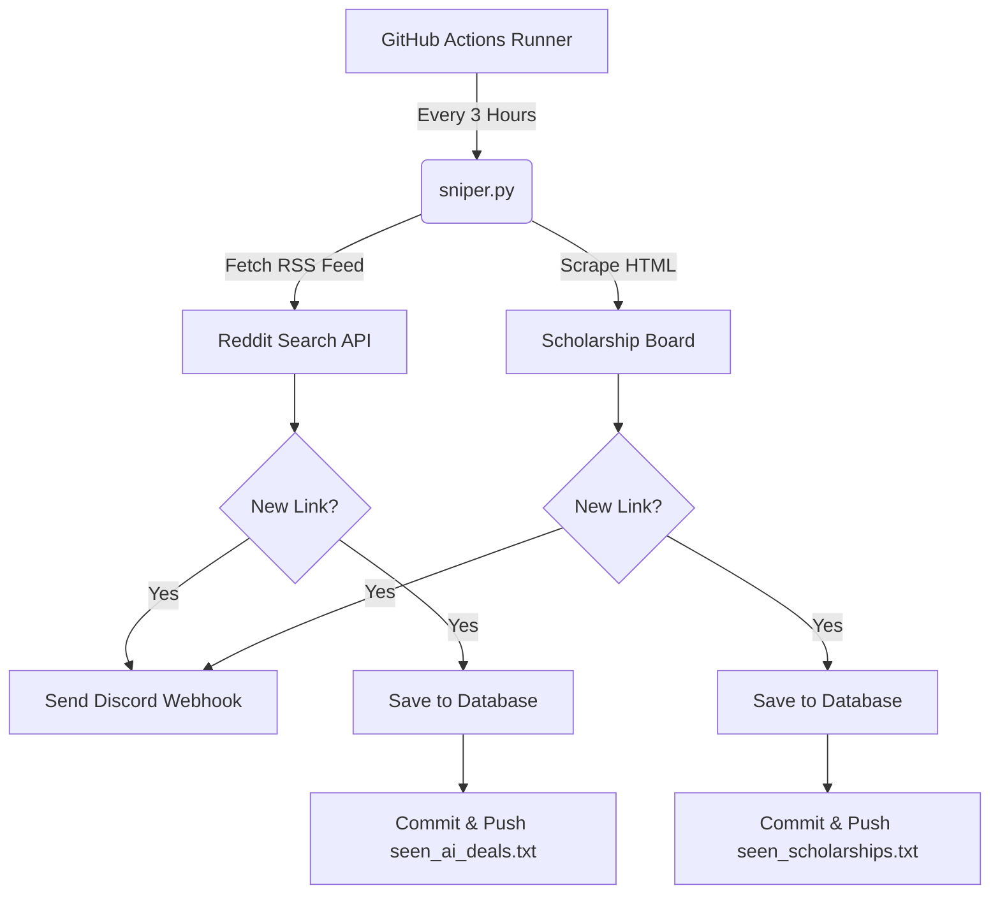

# Opportunity Sniper

An automated, serverless Python bot that monitors online sources (like Reddit and academic portals) for high-value opportunities—such as AI subscription discounts, coupons, and scholarships—and notifies you instantly via a Discord webhook.

It runs entirely in the cloud using **GitHub Actions** on a customizable cron schedule (default: every 3 hours/8 times a day) and automatically commits seen links to keep track of alerts.

---

## Features

- **Reddit RSS Tracking**: Pulls from search feeds (e.g., `r/ArtificialInteligence`) to check for deals, discounts, and free access.
- **BeautifulSoup Scraping**: Scrapes web portals for new application updates or deadlines.
- **Deduplication Database**: Keeps track of notified listings in separate files (`seen_ai_deals.txt` and `seen_scholarships.txt`) to avoid duplicate alerts.
- **Robust Network Layer**: Features request timeouts (10s) to prevent the automated runner from hanging on slow or offline pages.
- **Local Simulation**: Automatically logs alerts to console if no Discord webhook is provided, allowing easy local testing.

---

## Architecture



---

## Setup & Installation

### 1. Prerequisites

Make sure you have Python 3.10+ installed.

### 2. Clone and Install Dependencies

```bash
git clone https://github.com/ur1el0/opportunity-sniper.git
cd opportunity-sniper

# Create a virtual environment
python -m venv venv
source venv/bin/activate  # On Windows use: venv\Scripts\activate

# Install dependencies
pip install -r requirements.txt
```

---

## Configuration

### 1. Discord Webhook

1. Open your Discord server and go to the channel settings where you want alerts to be sent.
2. Select **Integrations** > **Webhooks** > **New Webhook**.
3. Copy the **Webhook URL**.

### 2. GitHub Secrets Setup

To enable the automated run:

1. Go to your repository on GitHub.
2. Click **Settings** > **Secrets and variables** > **Actions** > **New repository secret**.
3. Name it `DISCORD_WEBHOOK` and paste your Discord Webhook URL.

---

## Tutorial & Customization Guide

### How to Run Locally

To test the scraper locally, activate your virtual environment and run:

```bash
python sniper.py
```

_Note: If you do not have the environment variable `DISCORD_WEBHOOK` set, the script will output the found opportunities to your terminal rather than posting to Discord._

### How to Customize Scrape Targets

#### A. Changing Reddit Search Queries

To track different keywords or subreddits, open `sniper.py` and modify the `reddit_rss_url` parameters:

```python
# Change the subreddit name and search query parameters (q=...)
reddit_rss_url = "https://www.reddit.com/r/YOUR_SUBREDDIT/search.rss?q=YOUR_KEYWORD_1 OR YOUR_KEYWORD_2&restrict_sr=1&sort=new"
```

#### B. Modifying the Scholarship Web Scraper

Currently, the scraper parses raw link text from `scholarships.ph`. You can adapt this to parse any HTML page by modifying `scholarship_url` and updating the CSS selectors:

```python
scholarship_url = "https://example.com/scholarships"
try:
    response = requests.get(scholarship_url, headers=headers, timeout=10)
    soup = BeautifulSoup(response.text, 'html.parser')

    # Target specific classes or elements instead of generic 'a' tags
    for item in soup.find_all('div', class_='scholarship-post-item'):
        link_tag = item.find('a')
        title = link_tag.text.strip()
        link = urljoin(scholarship_url, link_tag['href'])

        # Apply your own filters
        if "apply" in title.lower():
            if link not in seen_scholarship_links:
                send_discord_alert(title, link, "PH Scholarship")
                save_seen(scholarship_seen_file, link)
```

### How to Adjust the Cron Schedule

To change how often the bot runs, open `.github/workflows/sniper.yml` and modify the cron expression:

```yaml
on:
  schedule:
    # Example: Runs every hour ('0 * * * *') or every 12 hours ('0 */12 * * *')
    - cron: "0 */3 * * *"
```
